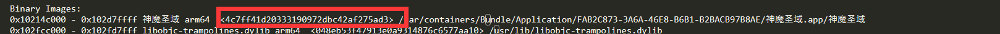

1、获取手机闪退日志：

手机连上mac后，xcode中，windows->devices and simulation中可以看到对应手机的闪退日志，.crash后缀（test.crash）
里面有一个uuid

2、导出包的符号表.dSYM
Xcode->product->Archive，右键Show in Finder

3、查看dsym的uuid
dwarfdump —uuid xxx.dsym

3、每次打的包和导出的符号表的uuid是对应的