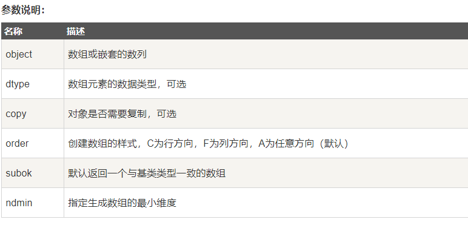
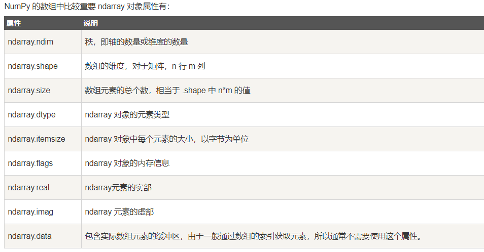

 python环境安装：
1、安装Anaconda3
Anaconda自带jupyter

## python总结：
### 元组
Python的元组与列表类似，不同之处在于元组的元素不能修改。
```
tup1 = ('physics', 'chemistry', 1997, 2000)
```
### 字典
```
d = {key1 : value1, key2 : value2 }
```
### 列表
```
list1 = ['physics', 'chemistry', 1997, 2000]
```
### 异常
```
try:
    fh = open("testfile", "w")
    fh.write("这是一个测试文件，用于测试异常!!")
except IOError:
    print "Error: 没有找到文件或读取文件失败"
else:
    # 没有异常
    print "内容写入文件成功"
    fh.close()
```
用raise触发异常
```
raise Exception("Invalid level!", level)
```
try-finally 语句
```
try:
    fh = open("testfile", "w")
    fh.write("这是一个测试文件，用于测试异常!!")
finally:
    print "Error: 没有找到文件或读取文件失败"
```

## numpy 学习：
[参考](https://www.runoob.com/numpy)
[官方文档《中文》](https://www.runoob.com/numpy)

```
numpy.array(object, dtype = None, copy = True, order = None, subok = False, ndmin = 0)
``` 


numpy 的数值类型实际上是 dtype 对象的实例，并对应唯一的字符，包括 np.bool_，np.int32，np.float32
```
numpy.dtype(object, align, copy)
```
object - 要转换为的数据类型对象
align - 如果为 true，填充字段使其类似 C 的结构体。
copy - 复制 dtype 对象 ，如果为 false，则是对内置数据类型对象的引用
 


### 创建数组
```
numpy.empty(shape, dtype = float, order = 'C')
```
shape	数组形状
dtype	数据类型，可选
order	有"C"和"F"两个选项,分别代表，行优先和列优先，在计算机内存中的存储元素的顺序。
```
numpy.zeros(shape, dtype = float, order = 'C')
```
shape	数组形状
dtype	数据类型，可选
order	'C' 用于 C 的行数组，或者 'F' 用于 FORTRAN 的列数组
```
numpy.ones(shape, dtype = None, order = 'C')
```
数组元素以 1 来填充：
```
numpy.arange(start, stop, step, dtype)
```
从范围创建数组
start	起始值，默认为0
stop	终止值（不包含）
step	步长，默认为1
dtype	返回ndarray的数据类型，如果没有提供，则会使用输入数据的类型。

索引：冒号分隔切片参数 start:stop:step 来进行切片操作：
 
