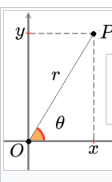
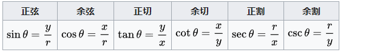
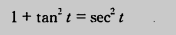

 
 
 
  
## 三角函数的公式
cos(α+β)=cosα·cosβ-sinα·sinβ
cos(α-β)=cosα·cosβ+sinα·sinβ
sin(α±β)=sinα·cosβ±cosα·sinβ
tan(α+β)=(tanα+tanβ)/(1-tanα·tanβ)
tan(α-β)=(tanα-tanβ)/(1+tanα·tanβ)
### 积化和差公式：
sinα·cosβ=(1/2)[sin(α+β)+sin(α-β)]
cosα·sinβ=(1/2)[sin(α+β)-sin(α-β)]
cosα·cosβ=(1/2)[cos(α+β)+cos(α-β)]
sinα·sinβ=-(1/2)[cos(α+β)-cos(α-β)]
### 和差化积公式：
sinα+sinβ=2sin[(α+β)/2]cos[(α-β)/2]
sinα-sinβ=2cos[(α+β)/2]sin[(α-β)/2]
cosα+cosβ=2cos[(α+β)/2]cos[(α-β)/2]
cosα-cosβ=-2sin[(α+β)/2]sin[(α-β)/2]
