## 初等函数：
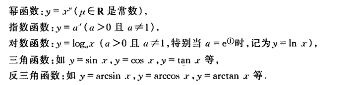
## 双曲函数：
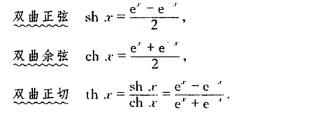
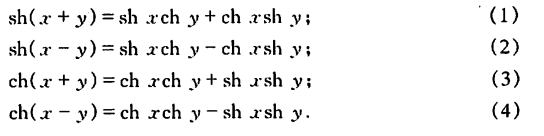
## 初等函数图形：
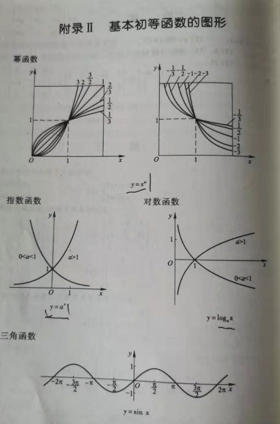
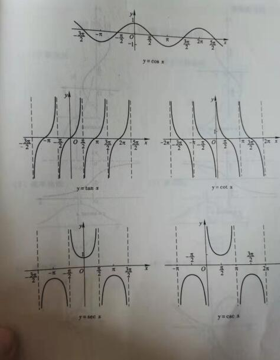
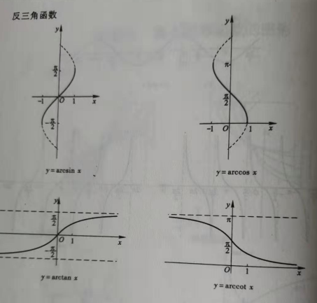 
## 双曲正弦和双曲余弦的图形
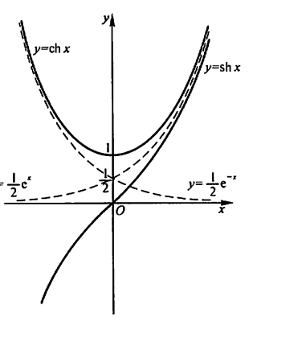
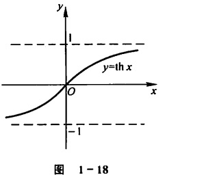 
## 反双曲
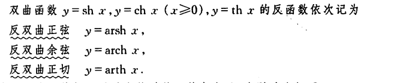
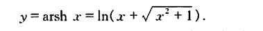
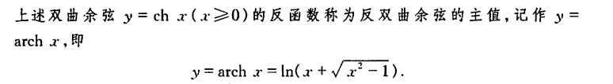
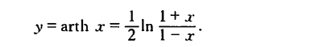
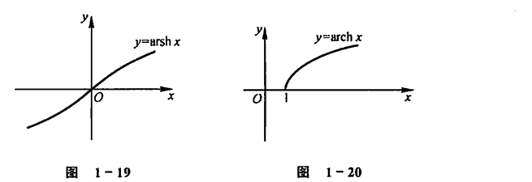
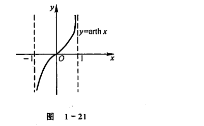
## 数列极限的定义
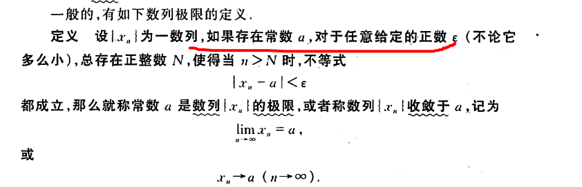
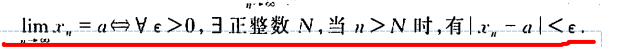
如果不存在 就说明数列没有极限或者说数列是发散
### 【**定理1:如果数列收敛，那么它的极限唯一**】
## 函数极限的定义
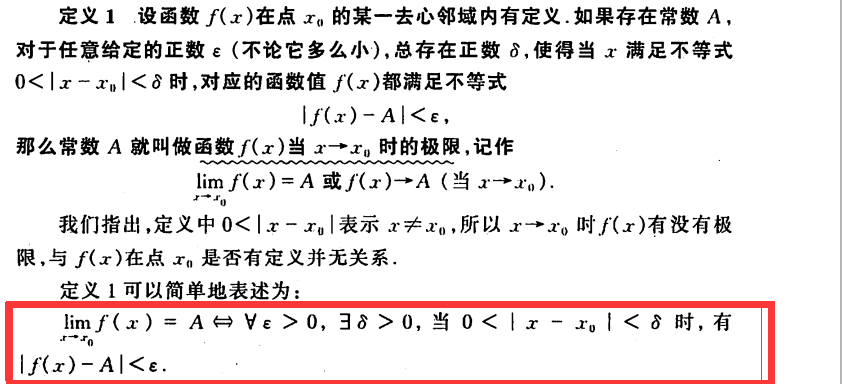
 ## 无穷小和无穷大
### 无穷小
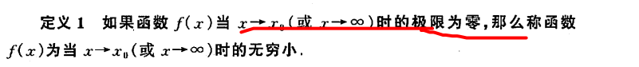
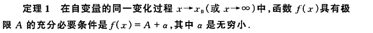
### 无穷大
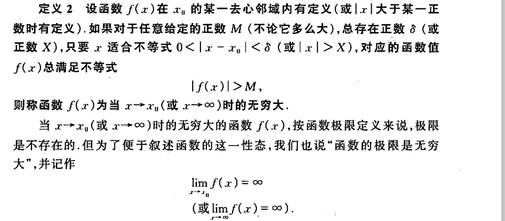
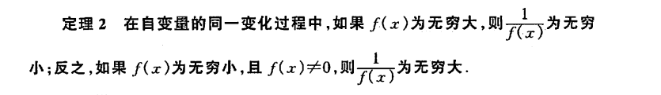
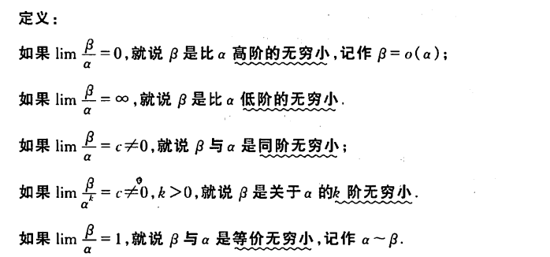
## 夹逼

## 重要的极限
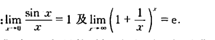
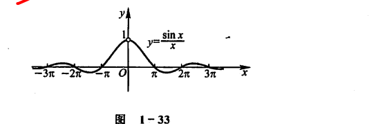
## 函数的连续性
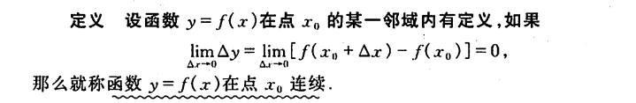
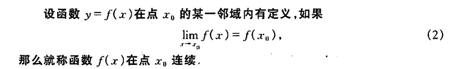
## 函数的间断点
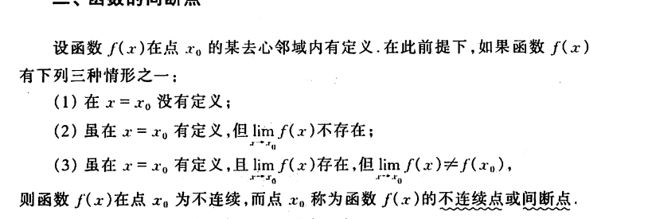
## 介值定理
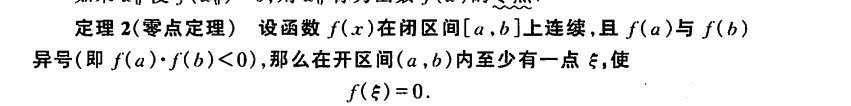
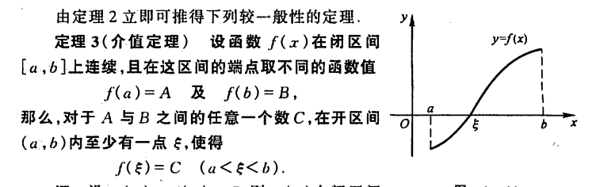