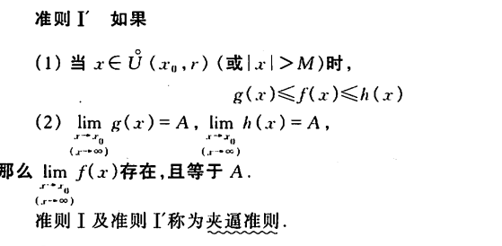

## 初等函数：

## 双曲函数：

## 初等函数图形：

 
## 双曲正弦和双曲余弦的图形

 
## 反双曲

## 数列极限的定义

如果不存在 就说明数列没有极限或者说数列是发散
### 【**定理1:如果数列收敛，那么它的极限唯一**】
## 函数极限的定义

 ## 无穷小和无穷大
### 无穷小

### 无穷大

## 夹逼

## 重要的极限

## 函数的连续性

## 函数的间断点

## 介值定理

