## 1. 齐次与线性的解释：
微分方程中所出现的未知函数的最高阶导数的除数，叫微分方程的阶
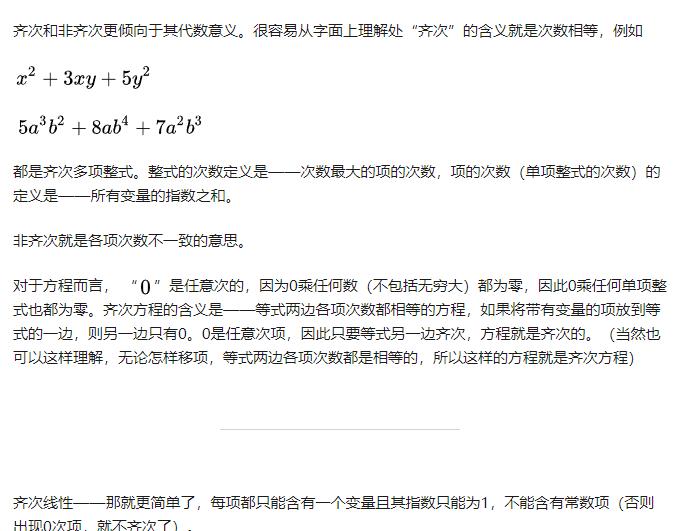   
## 2. 可分离变量的：
 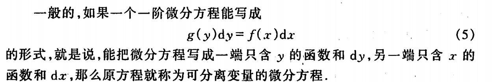   
## 3.一阶线性齐次
 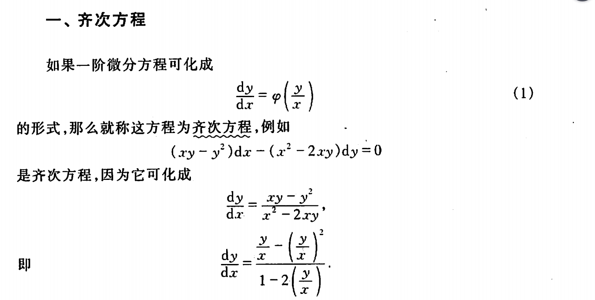    
## 3.一阶线性微分非齐次
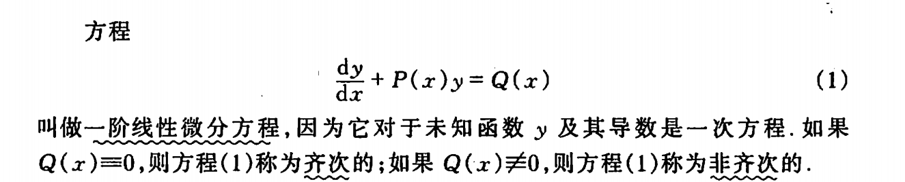    
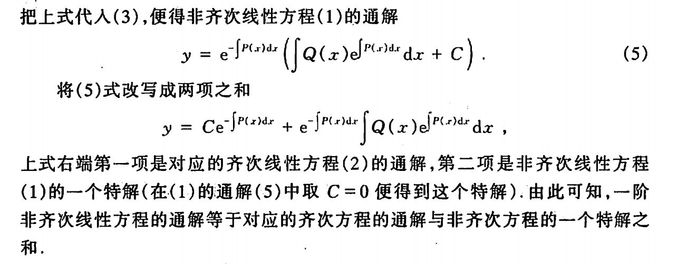  
## 4.伯努力
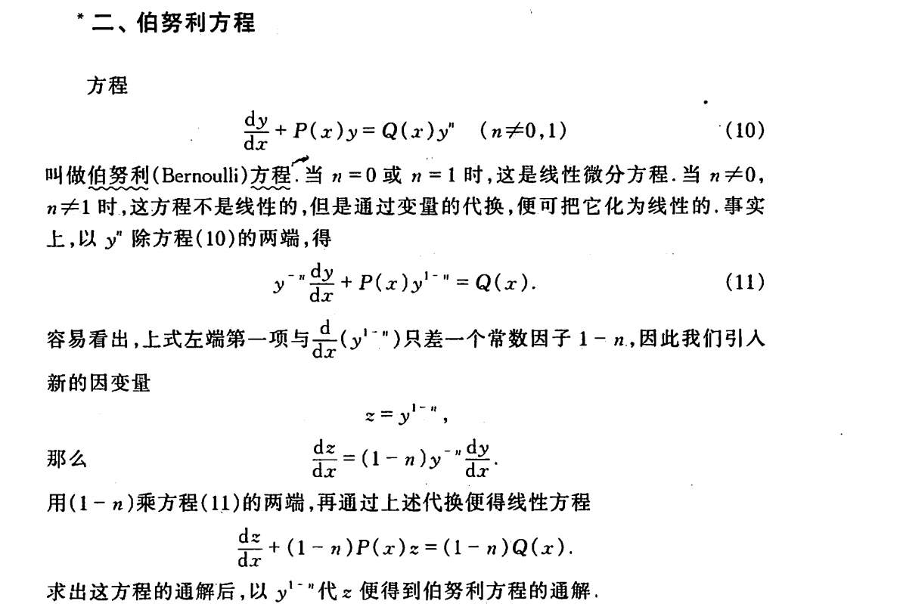   

## 特殊的微分方程
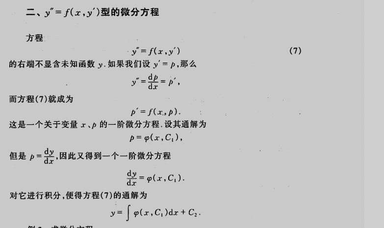
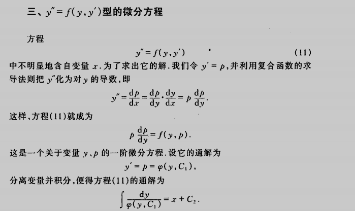 
## 4.高阶齐次
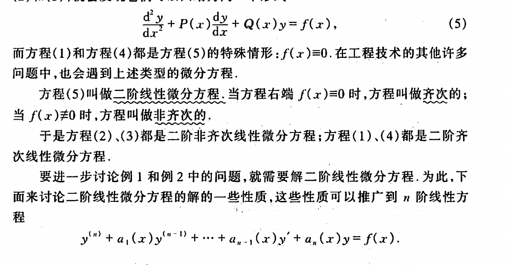    
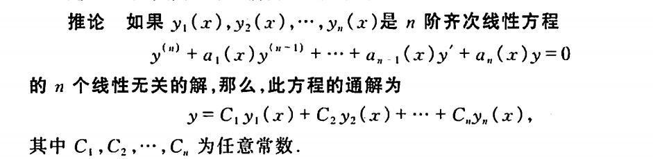     

## 5.常数变易法，非齐次
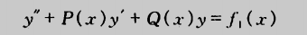   
对应   齐次
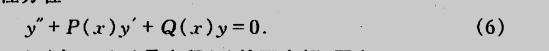   
假设齐次的通解为：
  
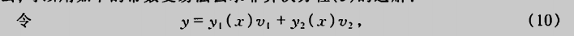  
求导得
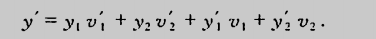   
为了使y的二阶导数，有红框中两个等式
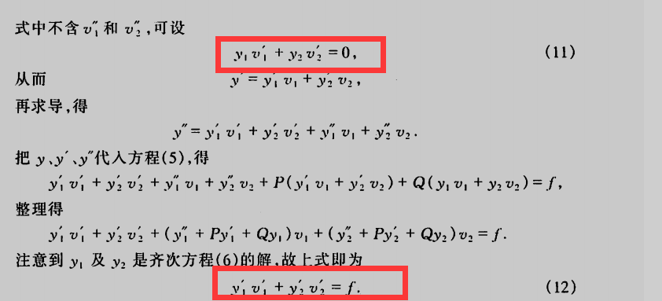    